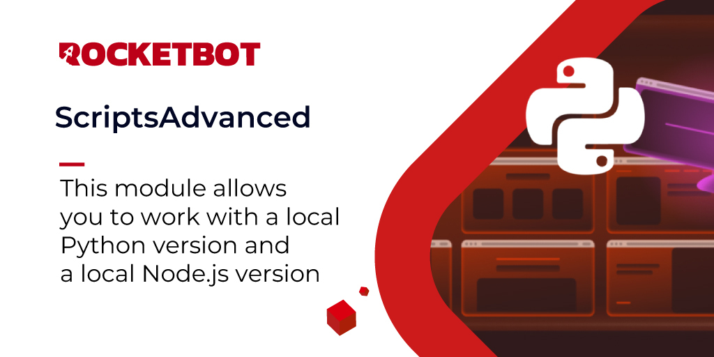

# ScriptsAdvanced
  
Este módulo permite que você trabalhe com uma versão local do Python e uma versão local do Node.js.  

*Read this in other languages: [English](Manual_ScriptsAdvanced.md), [Português](Manual_ScriptsAdvanced.pr.md), [Español](Manual_ScriptsAdvanced.es.md)*
  

## Como instalar este módulo
  
Para instalar o módulo no Rocketbot Studio, pode ser feito de duas formas:
1. Manual: __Baixe__ o arquivo .zip e descompacte-o na pasta módulos. O nome da pasta deve ser o mesmo do módulo e dentro dela devem ter os seguintes arquivos e pastas: \__init__.py, package.json, docs, example e libs. Se você tiver o aplicativo aberto, atualize seu navegador para poder usar o novo módulo.
2. Automático: Ao entrar no Rocketbot Studio na margem direita você encontrará a seção **Addons**, selecione **Install Mods**, procure o módulo desejado e aperte instalar.  

## Descrição do comando

### Executa Python
  
Executa python com uma rota de arquivo que você deseja
|Parâmetros|Descrição|exemplo|
| --- | --- | --- |
|Python Script|Script que será usado como prompt para executar python|Selecione um script|
|Argumentos de execucão|Argumentos de execucão|Argumentos|
|Atribuir resultado à variável|Variável onde o resultado da execução será armazenado serão os prints feitos no script|result|

### Executa Node.js
  
Executa Node.js com uma rota de arquivo que você deseja
|Parâmetros|Descrição|exemplo|
| --- | --- | --- |
|Script|Script que será usado como prompt para executar Node.js|Selecione um arquivo|
|Argumentos de execucão|Argumentos de execucão|Argumentos|
|Atribuir resultado à variável|Variável onde o resultado da execução será armazenado serão os prints feitos no script|result|

### Executar Linha de Comando
  
Gere conteúdo fornecendo uma entrada de linha de comando
|Parâmetros|Descrição|exemplo|
| --- | --- | --- |
|Instruções|Texto que será usado como prompt para gerar o conteúdo|Quais comandos você executará na linha de comando?|
|Atribuir resultado à variável|Variável onde o resultado da execução será armazenado|result|
